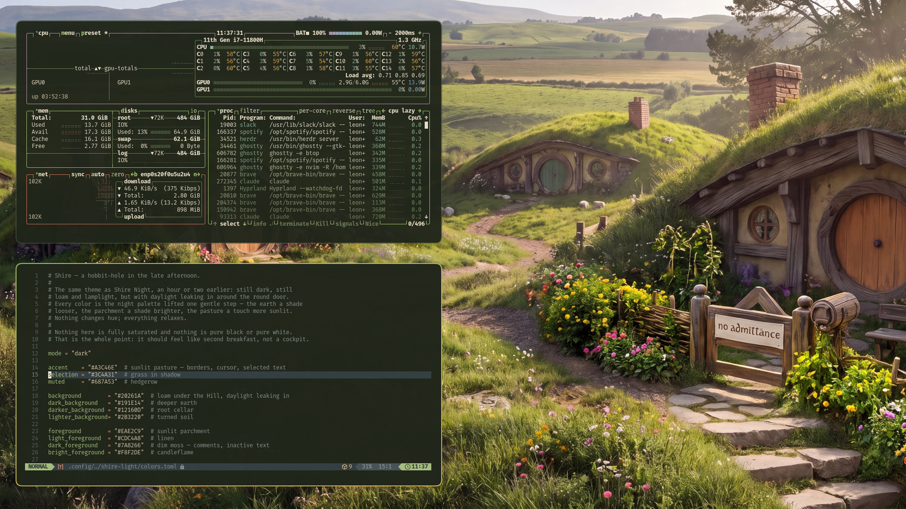

# Shire Light

An [Omarchy](https://omarchy.org) theme for the late afternoon, when the
round door stands open and daylight leaks into the hall.

Despite the name, this is still a dark theme — just a softer one. The gentler
sibling of [Shire Night](https://github.com/leonavas/omarchy-shire-night-theme):
still loam and lamplight, every color lifted one soft step, with all the
cozyness of the Shire. Nothing pure black, nothing pure white, nothing in a
hurry.



## Install

```bash
omarchy theme install https://github.com/leonavas/omarchy-shire-light-theme
```

## The palette

| | | |
|---|---|---|
| `#20261A` | loam | the earth the Hill is dug out of — background |
| `#A3C46E` | pasture | borders, cursor, anything chosen |
| `#E0B44F` | lamplight | brass, warm highlights |
| `#EAE2C9` | parchment | text |
| `#CC7058` | brick | the chimney |
| `#8A6A48` | oak | beams and doorframes |

Full set in [`colors.toml`](colors.toml) — the Shire Night palette, hue for
hue, each tone a shade lighter.

If you edit it, keep the notes on their own line — never after the value.
Several apps that read `colors.toml` split on `=` and keep everything that
follows, so `foreground = "#EAE2C9"  # parchment` reaches them as an invalid
colour and their text renders transparent.

## Round corners

Omarchy drops `.lua` from themes it installs from a repo, so the corners don't
travel. Put them in your own `~/.config/hypr/looknfeel.lua`:

```lua
hl.config({ decoration = { rounding = 10, rounding_power = 3 } })
```

Hobbit holes are round. `rounding_power = 3` gives a superellipse rather than a
plain arc, so the corners bulge a little — grown, not machined.

## More transparency

Optional, and to taste. In the same file:

```lua
o.window({ tag = "default-opacity" }, { opacity = "0.90 0.82" })
```

---

*"If more of us valued food and cheer and song above hoarded gold, it would be a merrier world."*
